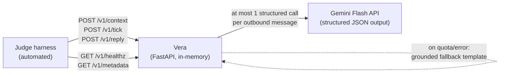
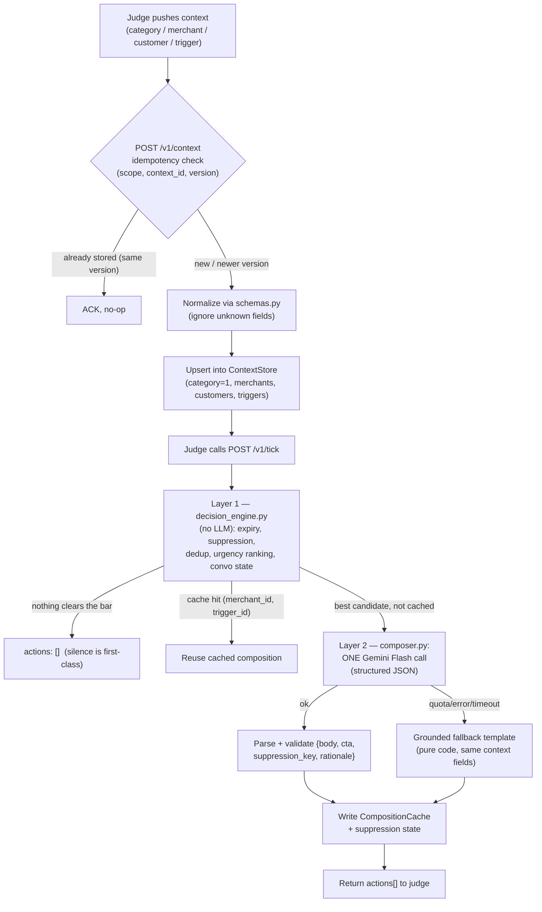
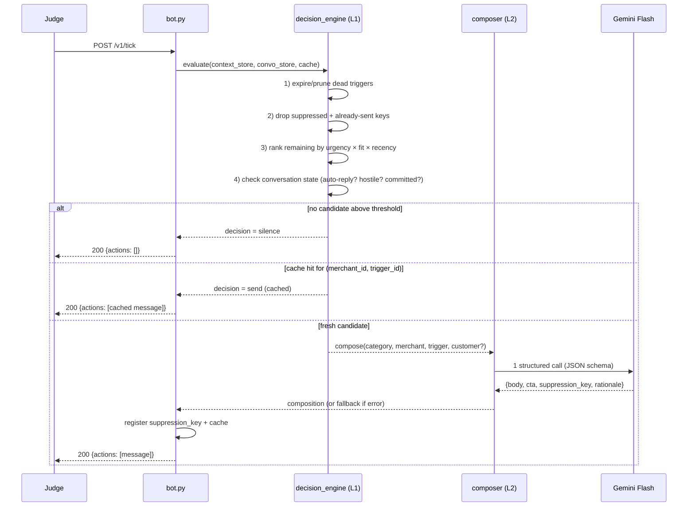
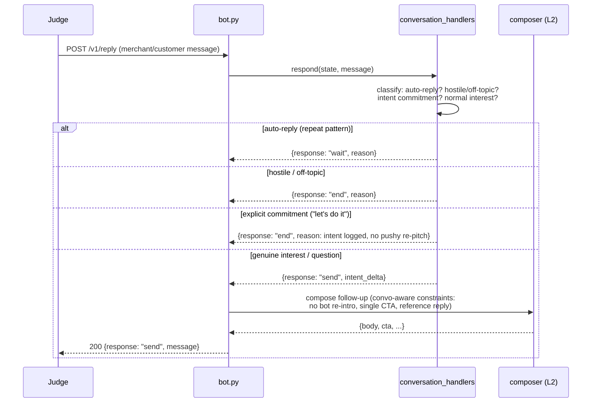
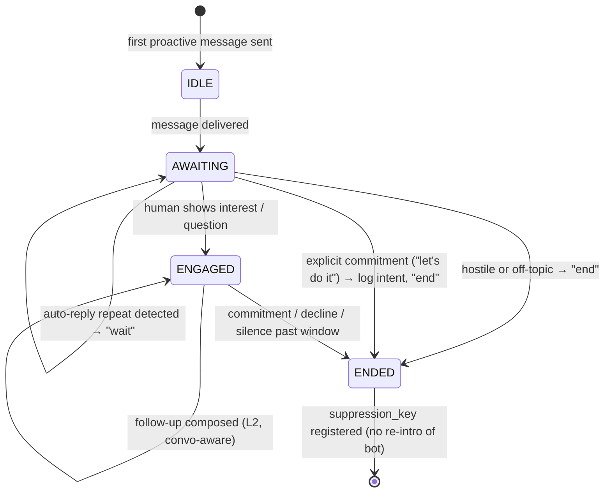
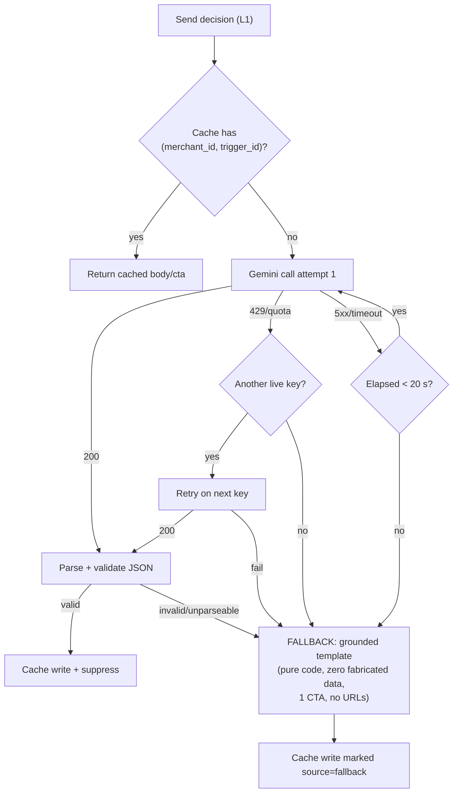
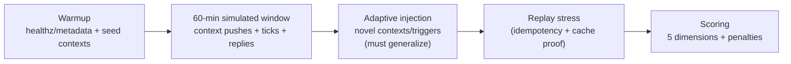

# Vera — Map / Flow Document

**Doc status:** v0.1 DRAFT — flows reflect the team's locked architecture. Details marked `⚠ VERIFY-ON-ZIP` (exact message/state names, conversation phases from `engagement-design.md`) will be tuned when the challenge materials arrive. Diagrams are Mermaid (renders in GitHub / VS Code / most viewers).

---

## 1. System Context (who talks to Vera)

- The judge is the **only** client that matters; it is also the clock (`/v1/tick` is the heartbeat — Vera never self-schedules).
- Gemini is the only external dependency, and only on the `send` path.

## 2. Data Flow — context push → composed message

**Key invariants:**
- Context payloads never trigger sends by themselves — only `/v1/tick` (and `/v1/reply` on the conversational path) emit actions.
- The **only** consumers of Gemini are ticks/replies where Layer 1 has already decided `send`.
- `suppression_key` from a composition is registered immediately so no later tick can re-send the same thing.

## 3. Request Lifecycle — `/v1/tick` (the main graded path)

**Timing budget:** L1 ≈ milliseconds; L2 ≤ 12 s hard per attempt, whole request ≤ ~20 s worst case, far inside the 30 s ceiling.

## 4. Request Lifecycle — `/v1/reply` (bonus, conversational path)

`⚠ VERIFY-ON-ZIP: exact `/v1/reply` response envelope + whether "send" must embed the message inline (api-call-examples.md).`

## 5. Conversation State Machine (conversation_handlers.py)

| Transition | Detector (pure code) | Response |
|---|---|---|
| Auto-reply repeat | Same/similar short ack repeated N times (e.g., "ok", "busy now") | `wait` |
| Hostility / off-topic | Category/taboo-agnostic keyword + sentiment heuristics | `end` |
| Intent commitment | Affirmative-commitment phrases ("let's do it", "book it", "send details") | `end` (or logistics-only send if spec wants confirmation `⚠ VERIFY-ON-ZIP: engagement-design.md`) |
| Genuine interest | Everything else with a question/positive signal | `send` via L2 |

`⚠ VERIFY-ON-ZIP: state names, thresholds, and any officially suggested transitions come from engagement-design.md / engagement-research.md — tune this diagram then.`

## 6. Failure & Degradation Flow (quota protection in motion)

- Breaker: 3 consecutive LLM failures ⇒ 60 s all-fallback mode (visible in `/v1/healthz`).
- Fallback compositions are cached too — replays never re-attempt the LLM for the same pair.

## 7. Test-Day Timeline (how the harness consumes the above)

